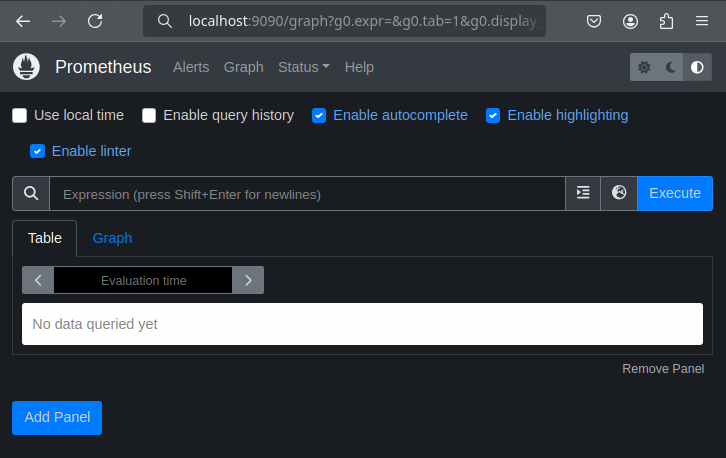
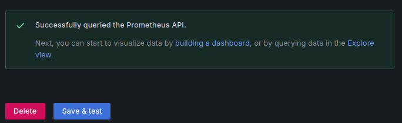

# Projeto de monitoramento e Observabilidade
Projeto de conclusão de curso de Monitoramento e Observabilidade da O2B Academy
<br>
O Projeto original você encontra no Gitlab do [**Professor Patrick J Cardoso**](https://github.com/patrickjcardoso/desafio_o11y) 
## Objetivo do Projeto:
Criar um ambiente de observabilidade usando Prometheus e Grafana para monitorar uma aplicação de exemplo.
<br>
## Technologies Used:
- Linux (Ubuntu based)
- Python Aplication
- Prometheus
- Grafana
- Alertmanager
- Docker 
- Docker-compose
- Alertmanager

## Pré-requisitos:
- Você precisará de uma máquina Linux (pode ser uma VM, um servidor ou mesmo uma máquina local com Docker instalado) Caso tenha o docker instalado, pule o passo 1.3.
- Conhecimento básico de linha de comando do Linux.
- Docker instalado na máquina.
- Uma aplicação de exemplo para monitorar (exemplo simples em Python).
- Clonar o repositório da atividade.

### passo 1: Instalação do curl, Docker, Docker-Compose e do Python
1.1. Crie um diretório chamado 'laboratório' (ou outro de sua escolha) no /home. (passo opcional)

```bash 

sudo apt update

sudo apt upgrade

#cria um diratório no diretório /home
$ sudo mkdir /home/laboratorio

#acessa o diretorio criado
$ cd /home/laboratorio

```
1.2. Instale o curl  
```bash
$ sudo apt install curl
```
1.3. Instale o docker  
```bash
$ sudo curl -fsSL http://get.docker.com | sh
```

1.4. Baixe o Docker Compose e instale-o em sua máquina se você ainda não o tiver:

  
```bash
# baixa a versão mais recente do Docker Compose do repositório oficial do GitHub e o salva no diretório /usr/local/bin
$ sudo curl -L "https://github.com/docker/compose/releases/latest/download/docker-compose-$(uname -s)-$(uname -m)" -o /usr/local/bin/docker-compose

#torna o arquivo baixado executável, permitindo que utilize o comando docker-compose no terminal.
$ sudo chmod +x /usr/local/bin/docker-compose
```

  
### Passo 2: Instalação do Prometheus e Grafana    
2.1. Crie um arquivo chamado **docker-compose.yml** para definir os serviços Prometheus, Grafana e alertmanager:
    
```yml
#version: '3'
services:
  prometheus:
    image: prom/prometheus  # Define a imagem do prometheus a ser usada.
    volumes:
    - ./prometheus/prometheus.yml:/etc/prometheus/prometheus.yml  # Mapeia o arquivo de configuração do Prometheus do host para o contêiner.
    - ./rules.yml:/etc/prometheus/rules.yml  # Mapeia o arquivo de regras do Prometheus do host para o contêiner.
    command:
    - '--config.file=/etc/prometheus/prometheus.yml'  # Define o comando a ser executado ao iniciar o contêiner.
    ports:
    - '9090:9090'  # Mapeia a porta 9090 do contêiner para a porta 9090 do host.
    network_mode: "host"  # Usa o modo de rede do host, permitindo que o contêiner compartilhe a rede do host.

  grafana:
    image: grafana/grafana  # Define a imagem do grafana a ser usada.
    ports:
    - '3000:3000'  # Mapeia a porta 3000 do contêiner para a porta 3000 do host.
    network_mode: "host"  # Usa o modo de rede do host, permitindo que o contêiner compartilhe a rede do host.
  
  alertmanager:
    container_name: alertmanager  # Define o nome do contêiner como "alertmanager".
    image: prom/alertmanager  # Define a imagem do Docker a ser usada para o serviço Alertmanager.
    volumes:
    - ./alertmanager.yml:/etc/alertmanager/alertmanager.yml  # Mapeia o arquivo de configuração do Alertmanager do host para o contêiner.
    ports:
    - 9093:9093  # Mapeia a porta 9093 do contêiner para a porta 9093 do host.
    network_mode: "host"  # Usa o modo de rede do host, permitindo que o contêiner compartilhe a rede do host.
```
2.2. Crie um arquivo chamado **rules.yml** para definir regras de alerta usados pelo Prometheus
```yml
groups:
 - name: Error greater than 5  # Nome do grupo de regras. Pode ser qualquer nome descritivo.
   rules:
   - alert: ErrorGreaterThan5  # Nome do alerta.
     expr: app_errors_total > 5  # define a condição do alerta. Neste caso, verifica se o total de erros na aplicação é maior que 5.
     for: 10s  # O tempo que a condição deve ser verdadeira antes que o alerta seja disparado. Aqui, se a condição for verdadeira por 10 segundos, o alerta será gerado.
```
2.3. Acesse ao site **https://webhook.site/** e copie a url que aparece em **Your unique URL** como mostrado abaixo.


2.4. Crie um arquivo chamado **alertmanager.yml** para gerenciar os alertas das aplicações. **Modifique a URL que está na linha 10 para a URL que você copiou no site webhook**

```yml
global:
  resolve_timeout: 5m  # Tempo para resolver alertas após a condição que os gerou ter sido resolvida.

route:
  receiver: webhook_receiver  # Define o receptor padrão para todos os alertas.
  
receivers:
  - name: webhook_receiver  # Nome do receptor.
    webhook_configs:
      - url: 'https://webhook.site/fad20e35-faaa-4f24-b7ae-bb013810e9cd'  # URL para onde os alertas serão enviados via webhook. (ALTERE A URL)
        send_resolved: false  # Define se o Alertmanager deve enviar uma notificação quando um alerta for resolvido.
```

2.5. Crie um diretório chamado prometheus e acesse ele:

```bash
#Cria um diretório chamado prometheus 
$ sudo mkdir prometheus

# Acessa o diretório prometheus criado 
$ cd prometheus
```

2.6 Crie um arquivo chamado **prometheus.yml** para configurar o Prometheus:
```yml
global:
  # Define configurações globais para todos os jobs de scraping.
  scrape_interval: 15s  # Intervalo de coleta de métricas definido para 15 segundos.

rule_files:
  - rules.yml  # Arquivo de regras para definir alertas e outras regras de Prometheus.

alerting:
  alertmanagers:
  - static_configs:
    - targets:
       - localhost:9093  # Endpoint do Alertmanager rodando localmente na porta 9093.

scrape_configs:
  # Configuração do job para monitorar o próprio Prometheus.
  - job_name: 'prometheus'  # Nome do job.
    static_configs:
      - targets: ['localhost:9090']  # Endpoint do Prometheus rodando localmente na porta 9090.

  # Configuração do job para monitorar a sua aplicação.
  - job_name: 'app.py'  # Nome do job.
    static_configs:
      - targets: ['localhost:3001']  # Endpoint da sua aplicação Python que será construída nos próximos passos rodando localmente na porta 3001.

```
### Passo 3: Criação da aplicação python 
3.1 Crie um diretório chamado **python** (dentro do diretório /home/laboratorio caso tenha feito o passo 1.1)
```bash
# Retornar para o diretório /home/laboratório
$ cd ..

#Cria o diretório python
$ sudo mkdir /home/laboratorio/python
 
#Acessa o diretório python
$ cd /home/laboratorio/python
```
3.2. instale o pip.
```bash
sudo apt install python3-pip
```

3.2. Crie um arquivo **app.py** que será uma aplicação em python a ser monitorada pelo Prometheus.

```python
from flask import Flask, request, Response
from prometheus_client import Counter, Histogram, generate_latest, REGISTRY
import time

app = Flask(__name__)

# Métrica para contar erros
error_count = Counter('app_errors_total', 'Total number of errors')

# Métrica para medir o tempo de execução de uma função
function_duration = Histogram('app_function_duration_seconds', 'Time spent in function execution', ['function_name'])

# Rota para página inicial com mensagem de boas-vindas
@app.route('/')
def welcome():
    welcome_message = """
    <html>

<head>
    <style>
        body {
            background-color: #6a5acd; /* Define a cor de fundo azul petróleo */
        }

        .center {
            text-align: center;
            font-size: 90px;
            color: white; /* Define a cor do texto como branco */
            margin-top: 50vh; /* Centraliza verticalmente usando margem superior */
            transform: translateY(-50%); /* Ajusta a posição verticalmente */
        }

        .links {
            text-align: center;
            margin-top: 20px;
            font-size: 24px;
        }

        .links a {
            color: white;
            text-decoration: underline;
            margin: 0 10px;
        }
        
    </style>
</head>

<body>
    <div class="center">
        <p>Bem-vindo ao desafio de Observabilidade da O2B Academy</p>
    </div>
    <div class="links">
        <a href="/generate-error">Gerar Erro</a>
        <a href="/calculate-duration">Calcular Duração</a>
        <a href="/metrics">Métricas</a>
    </div>
</body>

</html>
    """
    return welcome_message

# Rota para gerar erros intencionalmente
@app.route('/generate-error')
def generate_error():
    try:
        # Simulando uma exceção
        1 / 0
    except Exception as e:
        # Incrementando a métrica de erros
        error_count.inc()
        return f"Erro gerado: {str(e)}", 500

# Rota para medir o tempo de execução
@app.route('/calculate-duration')
def calculate_duration():
    start_time = time.time()
    # Simulando uma operação demorada
    time.sleep(2)
    function_duration.labels(function_name='calculate_duration').observe(time.time() - start_time)
    return "Tempo de execução medido com sucesso"

# Rota para expor métricas do Prometheus com quebras de linha
@app.route('/metrics')
def metrics():
    metrics_data = generate_latest(REGISTRY)
    return Response(metrics_data, content_type='text/plain; version=0.0.4')

# Rota para mostrar métricas no formato prometheus
@app.route('/metrics-text')
def metrics_text():
    return MetricsHandler(REGISTRY).do_GET(request)

if __name__ == '__main__':
    app.run(host='0.0.0.0', port=3001)

```
3.2. Instale o pacote Flesk prometheus_client.
```bash
pip install Flask prometheus_client
```

### Passo 4: Executar a aplicação Python
4.1 No diretório /home/laboratorio/python execute a aplicação.
```bash
$ nohup python3 app.py & 
```
4.2 Teste a aplicação. Acesse pelo navegador sua aplicação usando a segunte url: http://localhost:3001.


### Passo 5: Gerando métricas na aplicação
Acesse sua aplicação em clique em: **Gerar Erro** e depois em **Calcular Duração**

### Passo 6: Iniciando o Ambiente de Observabilidade
6.1. Volte para o diretório raiz do seu projeto e execute o seguinte comando para iniciar os serviços Prometheus e Grafana:

```bash
#Volta para o diretório raiz do seu projeto
$ cd ..

# executa os containers com as aplicações 
$ sudo docker-compose up -d

```
5.2 Certifique-se que os containers do Prometheus e do Grafana subiram e estão funcionando:
```bash
$ sudo docker-compose ps
```


### Passo 7: Acessando o Promethues e verificando as métricas da aplicação
7.1 Acesse o painel Promethues em seu navegador em http://localhost:9090.



7.2 Acesse o painel Promethues em seu navegador em http://localhost:9090.

- Clique no menu Status e depois em Targets.

  - O status deve estar UP para ambos os targets (Prometheus e your-app)
  - Caso o status da aplicação não esteja UP, certifique-se que a aplicação esteja rodando (Item 2.3).
  - Caso ainda não esteja UP ou com outro status, reveja a atividade, pois algum ponto pode ter faltado.


<br><br>
7.3 Agora vamos olhar as métricas configuradas em nossa aplicação:

- Métrica de Contagem de Erros (app_errors_total): Esta métrica conta o número total de erros que ocorreram em sua aplicação.


<br><br>

- Métrica de Duração da Função (app_function_duration_seconds): Esta métrica mede o tempo gasto na execução de funções específicas em sua aplicação. Você configurou rótulos para identificar a função específica sendo monitorada.


### Passo 8: Configurando o Grafana
8.1. Acesse o painel Grafana em seu navegador em http://localhost:3000.

8.2. Faça login com as credenciais padrão (username: admin, password: admin).
- **OBS: Ao digitar o usuário e a senha, será solicitado que altere a senha padrão para uma de sua preferência.**
  

<br><br>
8.3. Configure o Prometheus como uma fonte de dados:
- Clique em **Home** no menu à esquerda, **Connecions**,  **Data Sources**" e, em seguida, em **Add data source**.


- Escolha "Prometheus" como o tipo de fonte de dados.
  


- Na seção **Connection**, configure o URL para http://localhost:9090. Depois desça até o fim da página e clique em **Save & Test**
  
- **OBS: Após clicar em 'Save & Test' se o endereço do prometheus estiver correto aparecerá a mensagem como mostrado na imagem abaixo.**
  
  


### Passo 9: Criando um Painel no Grafana
9.1. Crie um novo painel clicando em **Home** e escolha **Dashboard**.


<br>

9.2. Clique em **Create dashboard**


<br>

9.3. Clique em **Add visuialization**


9.4. Selecione o Prometheus que você adicionou como fonte de origem


<br>

9.5 Selecione a métrica que gostaria de adicionar ao dashboard na opção de **metric** (app_erros_total), Adicione um título para o painel na opção **Title**, Clique em **Run queries** para gerar o gráfico e clique em **apply**.
- Adicione quantos métricas desejar ao painel.
  

<br>

9.6 Salve o painel clicando em **save dashboard** como mostrado abaixo.


<br>

### Passo 10: Verificando as mensagens do Alertmanager no Webhook.
10.1. Acesse o prometheus [http://localhost:9090](http://localhost:9090) e clique **Status** e selecione a opção **Rules** para verificar se a rule está com **State OK**.


<br>

10.2. Satisfaça a condição necessária para que o alerta ele seja enviado (**Condição: quantidade de erro maior 5**);
- Acesse a aplicação python na web pelo navegador [http://localhost:3001](http://localhost:3001)
- Clique na aba **Gerar Erro** conforme mostra a imagem do passo 4.2.
- Atualize a página pelo menos 6 vezes para que seja gerado os erros. 
- Realize o passo 7.3 para consultar a quantidade de erros.
- Acesse ao site Webhook que foi acessado no passo 2.3 e verifique que consta alertas enviados para o webhook como mostrado abaixo.
  

<br>
